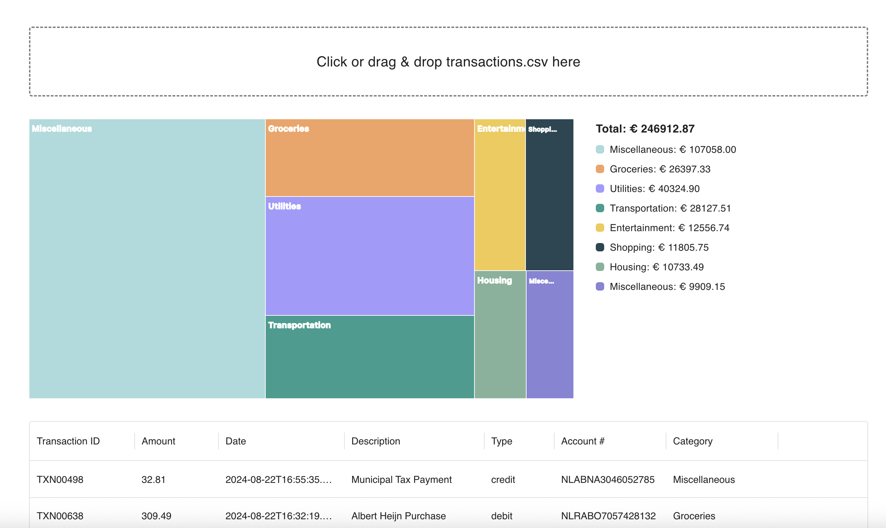

# Banking Transaction Categorization
The project is a full-stack solution that accepts raw banking transaction data (via CSV or API), automatically categorizes transactions using OpenAI, and displays them in a dashboard with visual analytics.


---

## Features
- CSV drag & drop upload
- Automatic categorization via OpenAI (batched and cached)
- PostgreSQL storage
- Rest API with OpenAPI docs

---

## Getting started

Setup
```
cp .env.example .env
docker-compose up --build
```
in .env:
```
OPENAI_API_KEY=your-key-here
```
Start front end:
```
cd frontend
npm install
npm run dev
```
Environment:
- Frontend: http://localhost:5173
- Backend: http://localhost:3000
- Swagger Docs: https://localhost:300/docs

## Running tests
```
cd backend
npm test
```

## Design decisions

### Batching (50 transactions per flush)
Categorize transactions in batches of 50 before sending them to OpenAI. Batching reduces API calls, improves throughput, and lowers cost per transaction.

Trade-offs:
- 🟢 More efficient and scalable under high load
- 🔴 Introduces small latency (up to 1-second delay before flush)
- 🔴 Requires coordination with FE to detect when all uploads are processed 

### Caching by account number
Cache categorization results using the account number as a key. Users often repeat the same transactions types per account (e.g. recurring bills), so caching avoids unnecessary API calls.

Trade-offs
- 🟢 Reduces OpenAI usage and cost
- 🟢 Speeds up processing of repeated transactions
- 🔴 Assumes transactions from the same account belong to the same category (which may be wrong in edge cases)

### Polling UI for FE updates

After CSV upload, the FE polls `/transactions` periodically to refresh the dashboard. It's simple and reliable way to reflect backend progress without requiring socket setup.

Trade-offs
- 🟢 Easy to implement
- 🔴 Can cause unnecessary load if polling is too frequent
- 🔴 Delay between final insert and UI update

### Flexible transaction identity
Use a composite key (`externalId`, `source`) to uniquely identify transactions. It allows importing transactions from different banking applications or data sources without collision.

Trade-offs
- 🟢 Future-proof for multi-source ingestion (e.g. multi-bank aggregation)
- 🔴 Slightly more complexity in deduplication and key lookup

## Room for improvement
- Logs & Monitoring
- Replace polling with WebSocket notifications
- Add auth